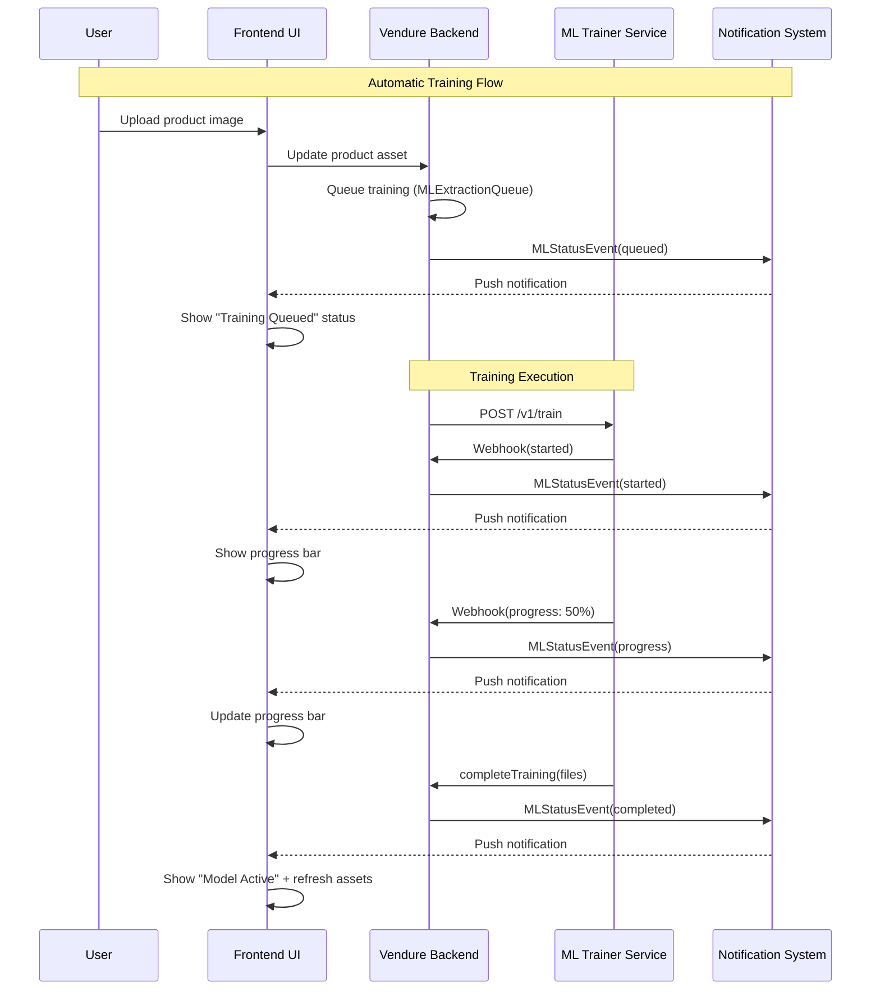

# ML Training End-to-End Frontend Integration

## Current State

**Backend (Complete):**

- Training is automatically triggered when product images change
- `MLStatusEvent` is published during training lifecycle (queued, started, progress, completed, failed)
- Events flow through `NotificationSubscriber` to create notifications

**Frontend (Partially Complete):**

- `MlTrainingService` exists with GraphQL operations but `startTraining` is NOT used (correct, since training is automatic)
- `MlTrainingStatusComponent` exists but is **orphaned** (not used anywhere)
- `MlModelStatusComponent` in Settings shows model assets but not training status
- Notification system already handles ML_TRAINING notifications

## Integration Plan

### 1. Enhance ML Model Tab in Settings

Combine the existing `MlModelStatusComponent` with training status display from `MlTrainingStatusComponent`.

**File:** [`frontend/src/app/dashboard/pages/settings/components/ml-model-status.component.ts`](frontend/src/app/dashboard/pages/settings/components/ml-model-status.component.ts)

Changes:

- Import and inject `MlTrainingService`
- Add training status section showing: status, progress bar, product/image counts, last trained date
- Add error display when training fails
- Remove "Start Training" button (training is automatic)
- Keep "Prepare Training Data" (extract photos) button for manual data refresh
- Add auto-refresh when notifications arrive

### 2. Connect to Notification Stream

**File:** [`frontend/src/app/dashboard/pages/settings/components/ml-model-status.component.ts`](frontend/src/app/dashboard/pages/settings/components/ml-model-status.component.ts)

- Subscribe to ML_TRAINING notifications from `NotificationStateService`
- Auto-refresh training info when a new ML notification arrives
- Show toast for training completion/failure

### 3. Update MlTrainingService

**File:** [`frontend/src/app/core/services/ml-training.service.ts`](frontend/src/app/core/services/ml-training.service.ts)

- Remove `startTraining` related code (not used for automatic training)
- Add method to subscribe to ML notification updates
- Ensure `extractPhotos` is the only manual action available

### 4. Clean Up Orphaned Component

**File:** [`frontend/src/app/dashboard/pages/channel-settings/components/ml-training-status.component.ts`](frontend/src/app/dashboard/pages/channel-settings/components/ml-training-status.component.ts)

- Delete this file as functionality will be merged into `MlModelStatusComponent`
- Remove the `channel-settings/components` directory if empty

## Data Flow Diagram

## UI Mockup

The enhanced ML Model tab will show:

1. **Training Status Card** (new)

   - Status badge (Idle/Queued/Training/Active/Failed)
   - Progress bar during training
   - Product count and image count
   - Last trained timestamp
   - Error message if failed

2. **Model Assets Card** (existing)

   - Model JSON status
   - Model Weights status  
   - Metadata status
   - Overall configuration progress

3. **Actions**

   - "Prepare Training Data" button (extract photos)
   - "Refresh" button
   - Remove any "Start Training" buttons