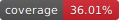

# Dukarun Architecture

> **Complete system design for V2 (Angular + Vendure)**

## Table of Contents

- [Overview](#overview)
- [Core Problem](#core-problem)
- [Technology Stack](#technology-stack)
- [System Architecture](#system-architecture)
- [Multi-tenancy Model](#multi-tenancy-model)
- [Data Flow](#data-flow)
- [ML Integration](#ml-integration)
- [Testing & Coverage](#testing--coverage)
- [Security](#security)

## Overview

Dukarun V2 is a **headless, API-first** point-of-sale system built on modern, scalable technologies. The system uses **Vendure** (a TypeScript e-commerce framework) as the backend and **Angular** for the frontend.

### Design Principles

- **API-First**: Backend is a headless service, decoupled from frontend
- **Modular**: Business logic in plugins, never modify framework code
- **Scalable**: Support growing tenants and transactions
- **Type-Safe**: TypeScript everywhere for robust, maintainable code

## Core Problem

**Small retail businesses struggle with inefficient sales and inventory recording.**

Our solution: An incredibly fast, intuitive POS system augmented with AI that makes recording sales and managing inventory effortless—no barcode scanners, no manual entry.

## Technology Stack

### Backend

| Component     | Technology       | Purpose                       |
| ------------- | ---------------- | ----------------------------- |
| **Framework** | Vendure (NestJS) | Headless commerce platform    |
| **Language**  | TypeScript       | Type-safe development         |
| **Database**  | PostgreSQL 16    | Relational data storage       |
| **Cache**     | Redis 7          | Session & performance caching |
| **API**       | GraphQL          | Efficient data fetching       |

### Frontend

| Component            | Technology         | Purpose                     |
| -------------------- | ------------------ | --------------------------- |
| **Framework**        | Angular 19         | SPA framework               |
| **UI Library**       | daisyUI + Tailwind | Component library & styling |
| **State Management** | RxJS + Signals     | Reactive state handling     |
| **API Client**       | Apollo GraphQL     | Type-safe API communication |

### ML & AI

| Component        | Technology      | Purpose               |
| ---------------- | --------------- | --------------------- |
| **Model Format** | TensorFlow.js   | Client-side inference |
| **Training**     | Python (future) | Model generation      |
| **Storage**      | Static files    | Public model hosting  |

## System Architecture

### Trunk → Branches → Leaves Architecture

This system follows a hierarchical architecture pattern where components are classified by their impact and coupling:

**Trunk: Core Services & Flows**
- Critical infrastructure that affects all features
- **Provisioning Services**: Customer registration, channel setup, entity creation
- **Auth Guards**: Channel access control, permission checks
- **Ledger System**: Financial transactions, double-entry accounting
- **RequestContext Management**: Transaction-aware context handling
- **Impact**: Changes here affect all features. Must be thoroughly tested.

**Branches: Major Feature Areas**
- Feature domains with significant business logic
- **Catalog**: Products, variants, assets, categories
- **Credit**: Customer/supplier credit management, outstanding balances
- **Suppliers**: Supplier management, purchase orders
- **POS**: Point-of-sale operations, order creation, payments
- **Impact**: Changes affect specific feature areas. Integration tests required.

**Leaves: UI & Feature-Specific Glue**
- User-facing features and integration points
- **Barcode Scanner**: Browser BarcodeDetector API integration
- **AI Image Recognition**: TensorFlow.js model loading and inference
- **Dashboard UI**: Angular components, routing, state management
- **ML Model Training**: Background jobs, model file generation
- **Impact**: Changes are isolated. Unit tests sufficient.

**Criteria for "Core" Classification:**
A component is "core" (trunk) if:
1. **Behavioral Impact**: Changes affect multiple features or system behavior
2. **Code Surface**: Used by many other components (high coupling)
3. **Data Integrity**: Handles critical data flows (provisioning, financial)
4. **Transaction Safety**: Must maintain consistency across operations

See [Provisioning Principles](./docs/PROVISIONING_PRINCIPLES.md) for detailed provisioning architecture.

### Component Diagram

```
┌─────────────────────────────────────────────────────────┐
│                    Client (Browser)                      │
│  ┌──────────────────────────────────────────────────┐  │
│  │         Angular SPA (Port 4200)                   │  │
│  │  • POS Interface  • Product Management            │  │
│  │  • ML Model Loading  • Offline Support            │  │
│  └──────────────────┬───────────────────────────────┘  │
└────────────────────┼────────────────────────────────────┘
                     │ GraphQL API
                     ▼
┌─────────────────────────────────────────────────────────┐
│              Backend Services (Docker)                   │
│                                                          │
│  ┌────────────────────────────────────────────────┐    │
│  │      Vendure Server (Port 3000)                 │    │
│  │  • GraphQL API  • Authentication                │    │
│  │  • Product Catalog  • Order Processing          │    │
│  └────────────────┬───────────────────────────────┘    │
│                   │                                      │
│  ┌────────────────┴───────────────────────────────┐    │
│  │      Vendure Worker (Background)                │    │
│  │  • ML Model Training  • Email Notifications     │    │
│  │  • Data Export  • Scheduled Tasks               │    │
│  └────────────────┬───────────────────────────────┘    │
│                   │                                      │
├───────────────────┼──────────────────────────────────┤
│                   ▼                                      │
│  ┌─────────────────────────┐   ┌──────────────────┐   │
│  │  PostgreSQL (Port 5433)  │   │  Redis (Port 6479)│   │
│  │  • Persistent Data       │   │  • Cache & Session│   │
│  └─────────────────────────┘   └──────────────────┘   │
└─────────────────────────────────────────────────────────┘
```

### Port Mapping

| Service    | Internal Port | Exposed Port | Purpose            |
| ---------- | ------------- | ------------ | ------------------ |
| Frontend   | 4200          | 4200         | Angular dev server |
| Backend    | 3000          | 3000         | Vendure API        |
| PostgreSQL | 5432          | 5433         | Database           |
| Redis      | 6379          | 6479         | Cache              |

## Customer & Supplier Management

Dukarun implements a unified customer and supplier management system using Vendure's native Customer entity with custom fields.

### System Design

- **Single Entity Approach**: Both customers and suppliers use Vendure's `Customer` entity
- **Identification**: `isSupplier: true` custom field marks suppliers
- **Key Insight**: **Every supplier is also a customer** - enabling suppliers to place orders and be managed through the same system
- **Payment Tracking**: `outstandingAmount` field tracks financial relationships (positive = owed to supplier, negative = customer owes)

### Custom Fields

```typescript
{
  isSupplier: boolean,        // Marks as supplier (default: false)
  supplierType: string,       // Manufacturer, Distributor, etc.
  contactPerson: string,      // Primary contact person
  taxId: string,             // Tax identification number
  paymentTerms: string,      // Payment terms (Net 30, COD, etc.)
  notes: text,               // Additional supplier notes
  outstandingAmount: number  // Amount owed (positive = owed to supplier, negative = customer owes)
}
```

### Benefits

1. **KISS Principle**: Simple extension of existing Vendure functionality
2. **No New Entities**: Reuses proven customer management
3. **Complete Integration**: Frontend and backend fully integrated
4. **Flexible**: Easy to extend with additional fields
5. **Vendure Native**: Uses framework's built-in features

**See [Customer & Supplier Implementation Guide](./docs/technical/CUSTOMER_SUPPLIER_IMPLEMENTATION.md) for complete technical details**

## Financial Ledger System

Dukarun uses a **double-entry ledger** as the single source of truth for all financial transactions. This ensures data integrity, auditability, and accurate financial reporting.

### Core Principles

1. **Ledger as Single Source of Truth**: All financial data (balances, outstanding amounts) comes from the ledger
2. **Double-Entry Accounting**: Every transaction creates balanced journal entries (debits = credits)
3. **Channel-Specific**: Each Vendure channel has its own Chart of Accounts and journal entries
4. **Atomic Transactions**: Domain changes and ledger postings occur in the same database transaction

### Architecture

The system uses a layered architecture:

- **FinancialService** (Facade): Clean API hiding accounting terminology
- **LedgerQueryService**: Aggregates balances from journal lines with caching
- **LedgerPostingService**: Maps domain events to journal entries
- **PostingService**: Core service creating balanced journal entries

### Key Features

- **Idempotency**: Same transaction (sourceType + sourceId) = same journal entry
- **Period Locks**: Historical periods can be locked for reconciliation
- **Balance Caching**: Performance optimization with cache invalidation
- **Chart of Accounts**: Required accounts initialized per channel

### Integration

- **Backend**: All financial operations go through `FinancialService`
- **Frontend**: No local calculations - always query backend for financial data
- **GraphQL**: All queries include ledger-based `outstandingAmount` fields

**See [Ledger Architecture Documentation](./docs/LEDGER_ARCHITECTURE.md) for complete technical details**

## Cashier Flow - Location-Based Two-Step Payment

Dukarun implements a location-specific cashier flow that enables a two-step sales process:

1. **Salesperson** adds items to cart and sends order to cashier (no customer required)
2. **Cashier** receives order with PENDING_PAYMENT status and collects payment

### Configuration

**Per-Location Toggles:**

- `cashierFlowEnabled` - Feature toggle (rarely changes)
- `cashierOpen` - Status toggle (open/close shifts)

**Data Flow:**

```typescript
// StockLocation custom fields
{
  cashierFlowEnabled: boolean,  // Enable feature at this location
  cashierOpen: boolean          // Currently accepting orders
}
```

### UI Behavior

**Sell Page:**

- Shows "Send to Cashier" when `cashierFlowEnabled = true`
- Hides button when `false`
- No customer required for cashier orders

**Dashboard:**

- Shows "Cash Register Open" badge when both `true`
- Shows "Cash Register Closed" when enabled but closed
- No badge when feature disabled

### Implementation Status

✅ Location-specific cashier flow toggle  
✅ Conditional UI based on active location  
✅ Status badge on dashboard  
✅ Session persistence  
🔲 Backend order creation (stub)  
🔲 Cashier station interface  
🔲 Payment integrations

## Multi-tenancy Model

Dukarun uses **Vendure Channels** for multi-tenancy, where each business is a separate channel.

### Tenancy Structure

```
SuperAdmin (Global)
│
├── Channel: Shop A (Business 1)
│   ├── Stock Location: Main Store
│   ├── Users: Manager, Cashier
│   └── Products: Catalog A
│
├── Channel: Shop B (Business 2)
│   ├── Stock Location: Downtown
│   ├── Users: Owner, Staff
│   └── Products: Catalog B
│
└── Channel: Shop C (Business 3)
    ├── Stock Location: Location 1, Location 2
    ├── Users: Multi-location Manager
    └── Products: Catalog C
```

### Key Concepts

- **Channel** = One business/customer company
- **Stock Location** = Physical store or warehouse
- **User Roles** = Scoped to specific channels
- **Products** = Can be shared or channel-specific

### Channel Provisioning

When creating a new business, manually provision:

1. ✅ Stock Location (required for inventory)
2. ✅ Payment Method (required for sales)
3. ✅ Roles (required for user access)
4. ✅ Assign Users (link users to roles)

**See [GAPS.md](./GAPS.md) for known limitations**

## Data Flow

### Sales Transaction Flow

```
1. Camera Scan
   ↓
2. ML Model Inference (client-side)
   ↓
3. Product ID Retrieved
   ↓
4. GraphQL Query (product details)
   ↓
5. Add to Cart (local state)
   ↓
6. Checkout
   ↓
7. Create Order (GraphQL Mutation)
   ↓
8. Update Inventory (automatic)
   ↓
9. Receipt Generation
```

### Product Recognition Flow

```
1. Admin enrolls label photos on a product
   ↓
2. Frontend embedder creates image embeddings
   ↓
3. Embeddings are saved on product custom fields
   ↓
4. Dashboard prefetch caches product fingerprints
   ↓
5. Scanner embeds live camera frames
   ↓
6. POS matches frame embeddings against cached products
```

## ML Integration

### Recognition Storage

```
Product.customFields
├── mlEmbedding          # JSON array of image embeddings
└── mlEmbeddingVersion   # Embedder version
```

### Runtime Model

Recognition runs in the frontend. There is no channel-level TensorFlow.js model file, model upload
flow, or `ml-trainer` microservice in the active architecture.

### Security Model

- **No public per-channel model files** - Recognition fingerprints are fetched through normal product queries
- **Sensitive data (prices, costs) fetched separately** via authenticated API
- **Embedder versioning** guards incompatible fingerprints
- **Client-side product caching** supports offline matching

**See [ML_PRODUCT_RECOGNITION.md](./docs/ML_PRODUCT_RECOGNITION.md) for implementation details**

## Testing & Coverage

### Testing Philosophy

The project follows a **behavior-driven testing approach** focused on real-world scenarios rather than implementation details:

- **Integration Tests**: Critical business logic and data flow
- **Behavioral Tests**: User journeys and system interactions
- **Migration Tests**: Database schema idempotence
- **Service Tests**: Core functionality and error handling

#### Why Low Coverage Targets Make Sense

**Integration tests don't execute much source code** - they focus on behavior:

- **Mock-Heavy**: We mock databases, services, and external dependencies
- **Behavior-Focused**: Tests verify "what happens" not "how it's implemented"
- **Real-World Scenarios**: User journeys, not code paths
- **Quality Over Quantity**: Better to have meaningful tests than high coverage

**Example**: A migration test verifies "migrations run idempotently" (behavior) rather than "every line of migration code executes" (coverage).

### Coverage Strategy

| Component    | Framework     | Coverage Target | Focus                         |
| ------------ | ------------- | --------------- | ----------------------------- |
| **Backend**  | Jest          | 20%             | Integration & business logic  |
| **Frontend** | Angular/Karma | 20%             | Component behavior & services |
| **Combined** | GitHub Actions | 20%             | Realistic integration focus   |

### Test Configuration

#### Backend Testing (`backend/jest.config.js`)

```javascript
module.exports = {
  preset: 'ts-jest',
  testEnvironment: 'node',
  collectCoverageFrom: [
    'src/**/*.ts',
    '!src/**/*.d.ts',
    '!src/migrations/**/*.ts',
    '!src/index.ts',
    '!src/index-worker.ts',
    '!src/populate.ts',
    '!src/vendure-config.ts',
    '!src/environment.d.ts',
  ],
  coverageDirectory: 'coverage',
  coverageReporters: ['text', 'lcov', 'html'],
};
```

#### Frontend Testing (`frontend/karma.conf.js`)

```javascript
coverageReporter: {
  dir: require('path').join(__dirname, './coverage/'),
  subdir: '.',
  reporters: [
    { type: 'html' },
    { type: 'text-summary' },
    { type: 'lcov' }
  ],
},
```

### GitHub Integration

#### Coverage Badges

```markdown
[](https://github.com/kisinga/Dukarun/actions/workflows/test.yml)



```

#### CI/CD Pipeline

- **Separate Jobs**: Backend and frontend tests run independently
- **Artifact Upload**: Coverage files stored as downloadable GitHub Actions artifacts
- **Coverage Summary**: Combined LCOV results are written to the GitHub Actions job summary
- **Repository Badges**: Successful pushes to `main` open or update a PR with refreshed backend, frontend, and combined coverage badges

### Local Development

#### Running Tests

```bash
# Backend coverage
npm run test:coverage -w @dukarun/backend

# Frontend coverage
npm run test:coverage -w @dukarun/frontend

# Combined summary and badge
npm run coverage:summary
```

#### Coverage Reports

- **Backend**: `backend/coverage/index.html`
- **Frontend**: `frontend/coverage/lcov-report/index.html`
- **Combined**: GitHub Actions job summary and the SVG badges under `badges/`

### Best Practices

1. **Focus on Integration**: Tests prioritize real-world scenarios
2. **Behavioral Testing**: Avoid overly specific implementation tests
3. **Mock Coverage**: Acceptable for development, real coverage in CI
4. **Incremental Improvement**: Gradually increase coverage targets
5. **Environment Independence**: Tests don't rely on `.env` files

### Troubleshooting

#### Local Issues

- **No Chrome**: Frontend uses mock coverage
- **Empty Coverage**: Tests are mostly mocks (expected)
- **Missing Reports**: Run the relevant `test:coverage` command first

#### CI Issues

- **Artifact Failures**: Check that `backend/coverage/` and `frontend/coverage/` exist after tests
- **Missing Badges**: Verify the workflow has `contents: write` permission and is running on `main`
- **Coverage Gaps**: Review test coverage patterns

## Security

### Authentication & Authorization

- **Cookie-based Sessions**: Vendure admin-api uses HTTP-only cookies (not JWT)
- **Session Storage**: Redis-backed for performance and scalability
- **Role-based Access**: Channel-scoped permissions
- **Password Hashing**: bcrypt with appropriate cost
- **CORS Credentials**: `credentials: 'include'` for cross-origin requests

### API Security

- **GraphQL**: Type-safe, introspection disabled in production
- **Rate Limiting**: Prevent abuse and DoS
- **CORS**: Configured for allowed origins
- **Input Validation**: All inputs sanitized and validated

### Data Protection

- **Encryption at Rest**: PostgreSQL encryption
- **Encryption in Transit**: HTTPS/TLS everywhere
- **Secrets Management**: Environment variables, never in code
- **Audit Logging**: Track sensitive operations

## Deployment

Dukarun uses platform-agnostic container images for flexible deployment.

### Key Principles

- **Independent Services**: Frontend, backend, database, and cache run independently
- **Environment-Based Config**: All configuration via environment variables
- **Docker Containers**: Self-contained images with all dependencies
- **Manual Local Dev**: Run services directly on host for fast iteration

**See [INFRASTRUCTURE.md](./INFRASTRUCTURE.md) for complete deployment guide and environment variables**

## Migration from V1

### V1 (PocketBase)

- **Backend**: Go + SQLite
- **Frontend**: Alpine.js + Vanilla JS
- **Auth**: Cookie-based
- **DB**: SQLite (single file)

### V2 (Vendure)

- **Backend**: TypeScript + PostgreSQL
- **Frontend**: Angular + RxJS
- **Auth**: JWT tokens
- **DB**: PostgreSQL (scalable)

**Complete migration documentation: [docs/v1-migration/MIGRATION_SUMMARY.md](./docs/v1-migration/MIGRATION_SUMMARY.md)**

## Performance Considerations

### Frontend Optimizations

- **Lazy Loading**: Routes and components loaded on-demand
- **Virtual Scrolling**: Efficient rendering of large lists
- **Image Optimization**: WebP with fallbacks
- **Service Workers**: Offline support and caching

### Backend Optimizations

- **Database Indexing**: Optimized queries
- **Connection Pooling**: Efficient database connections
- **Redis Caching**: Frequently accessed data cached
- **GraphQL DataLoader**: Batch and cache database queries

## Monitoring & Observability

Dukarun uses **SigNoz** as a unified observability platform providing traces, metrics, and logs.

### Architecture

- **SigNoz**: Self-hosted observability platform (Docker)
- **OpenTelemetry**: Automatic instrumentation (HTTP, GraphQL, PostgreSQL, Redis)
- **Manual Instrumentation**: Business operations (orders, payments, ledger, ML, registration)
- **Data Flow**: Frontend → OTLP HTTP → SigNoz ← OTLP gRPC ← Backend (Server/Worker)

### Key Features

- **Distributed Tracing**: End-to-end request flows across frontend and backend
- **Metrics**: Business KPIs (orders, payments) and performance metrics (latency, error rates)
- **Log Correlation**: Automatic trace ID inclusion in logs for correlation
- **Automatic Instrumentation**: HTTP, GraphQL, database, and Redis operations

### Services Instrumented

- **Backend Server**: `dukarun-backend-dukarun-server`
- **Backend Worker**: `dukarun-backend-dukarun-worker`
- **Frontend**: `dukarun-frontend`

### Configuration

- **Backend**: `SIGNOZ_ENABLED`, `SIGNOZ_HOST`, `SIGNOZ_OTLP_GRPC_PORT`
- **Frontend**: `ENABLE_TRACING`, `SIGNOZ_ENDPOINT` (runtime config via `window.__APP_CONFIG__`)

See [OBSERVABILITY.md](./docs/OBSERVABILITY.md) for setup and usage guide.

## Product Creation Flow (Transactional)

The product creation process is implemented as a **two-phase transaction**:

### Phase 1: Core Transaction (Blocking)

This phase ensures data consistency. All steps must succeed or the entire operation fails.

```
1. VALIDATION
   - Check all SKUs are unique
   - Check no SKUs already exist in system
   ↓
2. CREATE PRODUCT
   - Creates base product in Vendure
   ↓
3. CREATE VARIANTS (Sequential)
   - Creates each variant one-at-a-time
   - Avoids Vendure's unique option combination constraint
   - If ANY variant fails → ROLLBACK entire product
```

**Entry Point:** `ProductService.createProductWithVariants()`

**Error Handling:**

- Validates all inputs BEFORE making any mutations
- If variant creation fails, attempts to rollback (delete) the product
- Returns `productId` on success, `null` on any failure
- Error message is saved to `productService.error()` signal

### Phase 2: Photo Upload (Non-Blocking)

This phase is optional and does not block the overall transaction success.

```
4. UPLOAD PHOTOS (Separate)
   - Frontend uploads files directly to admin-api
   - Uses GraphQL multipart protocol
   - Creates assets from files
   - Assigns assets to product
   ↓
   If fails: User is warned but product/variants remain created
   Photos can be added manually later via product edit
```

**Current Implementation (Frontend Upload):**

- Photos uploaded directly from browser to admin-api
- Uses `credentials: 'include'` for cookie-based auth
- Simple, works immediately, no backend code needed
- **Limitation:** Large uploads can fail on slow networks

**Future Implementation (Backend Batch Processor):**

Move photo upload to backend for better reliability:

```
Frontend: Save photos to temp storage
    ↓
Backend: Queue upload job (Redis/BullMQ)
    ↓
Worker: Process uploads in background
    ↓
    - Retry on failure (3 attempts)
    - Progress updates via websocket
    - Cleanup temp files after success
```

Benefits:

- Resilient to network issues
- Progress tracking
- Better error recovery
- No browser timeout limits

**Key Design Decisions:**

1. **Sequential Variants** (not batch)
   - Vendure requires unique option combinations per variant
   - Creating variants sequentially avoids this constraint
   - Each variant gets its own mutation call

2. **SKU Validation**
   - Checked BEFORE creating product
   - Prevents orphaned products with invalid variants
   - Uses `CHECK_SKU_EXISTS` query

3. **Non-Blocking Photos**
   - Product/variants success doesn't depend on photos
   - If upload fails, user can retry or add photos later
   - Prevents data loss from file upload issues

4. **Rollback Strategy**
   - Variant failure → delete product (automatic cleanup)
   - Photo failure → no rollback (product already created)
   - This ensures no orphaned products

### Console Logging

The process logs each phase for debugging:

```
🔍 Validating product and variants...
✅ Validation passed
📦 Creating product...
✅ Product created: 22
📦 Creating variants...
🔧 Creating variant 1/2: 1kg
✅ Variant 1 created: 1kg
🔧 Creating variant 2/2: 2kg
✅ Variant 2 created: 2kg
✅ All 2 variants created successfully
✅ Product and variants created successfully

[Phase 2 - Non-blocking]
📸 Transaction Phase 2: Uploading 5 photo(s)...
✅ Transaction Phase 2 COMPLETE: Photos uploaded
```

Or if Phase 2 fails:

```
⚠️ Transaction Phase 2 FAILED: Photos upload failed
⚠️ But product was successfully created (photos can be added later)
```

### Future Improvements

1. **Implement Product Deletion Mutation**
   - Currently rollback just logs (DELETE_PRODUCT needs implementation)
   - Add `DELETE_PRODUCT` GraphQL mutation to backend

2. **Batch Asset Upload**
   - Create all assets in one mutation instead of sequentially
   - Will require backend optimization

3. **Transaction Support**
   - Coordinate with Vendure to see if they support real transactions
   - May require backend changes

---

**Last Updated:** October 2025  
**Version:** 2.0  
**Status:** Active Development
