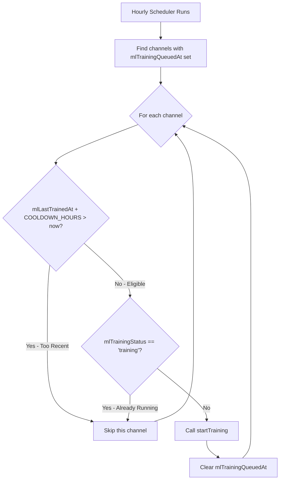

# Dukarun ML Trainer Microservice

Dedicated TypeScript/Node.js microservice for training TensorFlow.js models using transfer learning on MobileNet V2.

## Features

- **Transfer Learning**: Retrains the top layer of MobileNet V2 for custom product recognition.
- **TensorFlow.js Node**: Uses native C++ bindings for performance.
- **Teachable Machine Compatible**: Produces models fully compatible with the frontend integration.
- **Webhook Integration**: Reports progress and upload results back to the main backend.

## API

### POST /v1/train

Triggers a training job. The service processes this asynchronously.

**Request Body:**

```json
{
  "channelId": "123",
  "manifestUrl": "http://backend:3000/admin-api/manifest...",
  "webhookUrl": "http://backend:3000/ml/webhook",
  "authToken": "secure-token"
}
```

**Response:**

```json
{
  "message": "Training job accepted",
  "jobId": "123"
}
```

## Development

### Prerequisites

- Node.js 20+
- TypeScript 5.3+
- Python 3, Make, G++ (for compiling tfjs-node bindings)

### Setup

```bash
# Install dependencies
npm install

# Build TypeScript
npm run build

# Run in dev mode (with hot reload)
npm run dev

# Run production build
npm start
```

## Docker

The service is included in the main `docker-compose.yml`.

```bash
docker compose up -d ml-trainer
```

## Architecture

1.  **Extract**: Backend generates a manifest JSON containing product IDs and image URLs.
2.  **Download**: Trainer downloads all images to a temporary directory.
3.  **Train**:
    - Loads MobileNet V2 (frozen base).
    - Adds custom classification head.
    - Trains for 20 epochs using the downloaded images.
4.  **Export**: Saves `model.json`, `weights.bin`, and `metadata.json`.
5.  **Upload**: Uploads the artifacts back to the backend via GraphQL mutation.

Rate Limiting Logic
The rate limiting is per-channel and uses a simple timestamp comparison:


